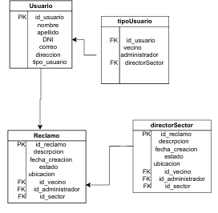

TuReclamo es una app que busca agilizar un reclamo de ciudadano ante un municipio de Mendoza.
Integrantes:
Adriana Antunez
Iara Fernandez
Lara Magallanes
Carolina Lopez

Entidades principales (mínimo 3)

USUARIO

    PK: id_usuario

    Atributos: nombre, apellido, DNI, correo, direccion, tipo_usuario (puede ser vecino o administrador)

RECLAMO 

    PK: id_reclamo

    Atributos: descripcion, fecha_creacion, estado, ubicacion

FK:

     id_vecino → referencia a Usuario (cuando es tipo "vecino")

     id_administrador → referencia a Usuario (cuando es tipo "administrador")

     id_sector → referencia a Sector

SECTOR (o DirectorSector)

     PK: id_sector

    Atributos: nombre_sector, descripcion

    Relación: un sector puede tener reclamos asociados y un director responsable.

