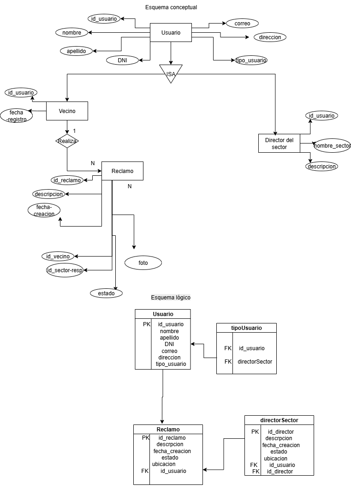

# 🌟 TuReclamo - App de Gestión de Reclamos Ciudadanos


---

## ✨ Descripción del Proyecto

**TuReclamo** es una aplicación pensada para **agilizar los reclamos de los ciudadanos ante el municipio de Mendoza**, mejorando la comunicación, la transparencia y la eficiencia en la resolución de problemas urbanos. 🚀🏙️

La plataforma permite:

* Reportar problemas como árboles caídos, cortes de luz, baches y residuos 🌳💡🛣️🗑️
* Hacer seguimiento en tiempo real de cada reclamo 🔄
* Facilitar la comunicación entre vecinos y autoridades municipales 🤝

---

## 👩‍💻 Integrantes del Equipo

| Integrantes          |
| ------------------- | 
| **Iara Fernandez**  |
| **Carolina Lopez**  | 
| **Lara Magallanes** | 
| **Adriana Antunez** | 

> Trabajando juntas para crear un puente entre vecinos y autoridades 💪✨

---

## 🏛️ Entidades Principales

### 1️⃣ Usuario

* **PK:** `id_usuario`
* **Atributos:** `nombre, apellido, DNI, correo, direccion, tipo_usuario (vecino o administrador)`

### 2️⃣ Reclamo

* **PK:** `id_reclamo`
* **Atributos:** `descripcion, fecha_creacion, estado, ubicacion`
* **FK:**

  * `id_vecino` → referencia a Usuario (vecino)
  * `id_administrador` → referencia a Usuario (administrador)
  * `id_sector` → referencia a Sector

### 3️⃣ Sector (DirectorSector)

* **PK:** `id_sector`
* **Atributos:** `nombre_sector, descripcion`
* **Relación:** Un sector puede tener varios reclamos y un director responsable.

---

## 📊 Diagrama de Relaciones



---

## ⚡ Características del Proyecto

* CRUD completo para **usuarios, reclamos y sectores** ✅
* API RESTful con **Flask + SQLAlchemy + MySQL** 🔥
* **Frontend básico con Bootstrap** para mostrar listados y formularios 💻
* Gestión de migraciones con **Flask-Migrate** 🔄
* Uso de **variables de entorno** para configuración segura 🌱

---

## 🛠 Requisitos

* Python 3.x 🐍
* MySQL 🗄️
* Pip (`pip install`)

---

## 🌱 Configuración del Entorno

### 1️⃣ Crear un entorno virtual

**Linux / macOS:**

```bash
python3 -m venv <nombre_del_entorno>
```

**Windows:**

```bash
python -m venv <nombre_del_entorno>
```

### 2️⃣ Activar el entorno virtual

**Linux / macOS:**

```bash
source <nombre_del_entorno>/bin/activate
```

**Windows:**

```bash
<nombre_del_entorno>\Scripts\activate
```

### 3️⃣ Instalar dependencias

```bash
pip install -r requirements.txt
```

---

## 🗄️ Configuración de la Base de Datos

Crear un archivo `.env` con tus credenciales:

```env
MYSQL_USER=<tu_usuario>
MYSQL_PASSWORD=<tu_contraseña>
MYSQL_DATABASE=<nombre_de_la_base_de_datos>
MYSQL_HOST=<host_de_mysql>
```

---

## 🚀 Instalación y Ejecución

1. Clona el repositorio:

```bash
git clone <url_del_repositorio>
```

2. Accede al directorio del proyecto:

```bash
cd <nombre_del_proyecto>
```

3. Ejecuta la aplicación:

```bash
python app.py
```
